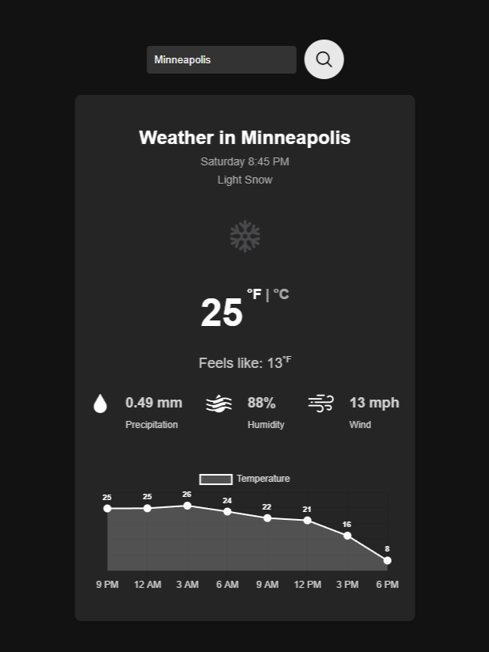

# Weather App 🌦️

A sleek and minimalist weather application that provides real-time weather data, including temperature, humidity, wind speed, and precipitation. This app uses the [OpenWeatherMap API](https://openweathermap.org/api) and is built with Python Flask for the backend and HTML, CSS, and JavaScript for the frontend.

## Features
- Search for current weather data by city name.
- Displays:
  - Temperature (with "feels like" temperature).
  - Humidity, wind speed, and precipitation.
  - A 24-hour temperature forecast displayed as a graph.
- Toggle between Fahrenheit (°F) and Celsius (°C).
- Dark theme with responsive design for modern browsers.

## Demo
[Link to Live Demo](https://aris-weather-app.onrender.com/)

## Tech Stack
- **Frontend**:
  - HTML5, CSS3, JavaScript (ES6+)
  - [Chart.js](https://www.chartjs.org/) for graphing the 24-hour forecast.
- **Backend**:
  - Python Flask
  - OpenWeatherMap API
- **Hosting**:
  - Render

## Installation
Follow these steps to run the project locally:

### Prerequisites
- Python 3.8 or above
- Node.js (Optional, for advanced frontend features)

### Steps
1. Clone the repository:
   ```bash
   git clone https://github.com/your-username/weather-app.git
   cd weather-app
   ```

2. Install Python dependencies:
   ```bash
   pip install -r requirements.txt
   ```

3. Set up environment variables:
   - Create a `.env` file in the root directory and add your OpenWeatherMap API key:
     ```
     FLASK_APP=app.py
     FLASK_ENV=development
     API_KEY=your_openweathermap_api_key
     ```

4. Run the Flask app:
   ```bash
   flask run
   ```

5. Open your browser and navigate to:
   ```
   http://127.0.0.1:5000
   ```

## Screenshots


## Roadmap
- [ ] Add support for location-based weather search.
- [ ] Implement a weekly weather forecast.
- [ ] Optimize for mobile performance.

## License
This project is licensed under the MIT License. See the `LICENSE` file for details.

## Acknowledgments
- Weather data provided by [OpenWeatherMap](https://openweathermap.org/).
- Icons made by [Freepik](https://www.flaticon.com/authors/freepik) from [Flaticon](https://www.flaticon.com/).
